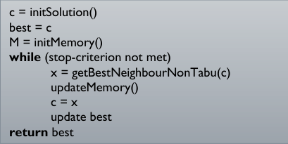
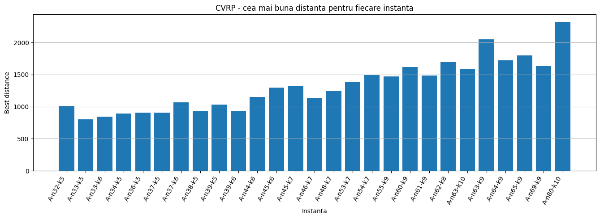
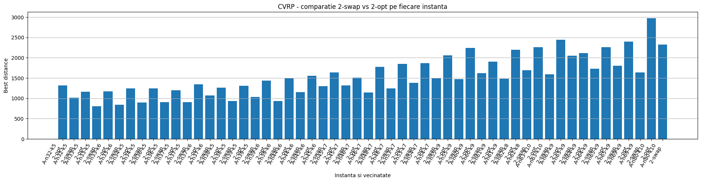
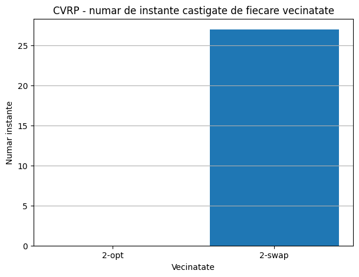
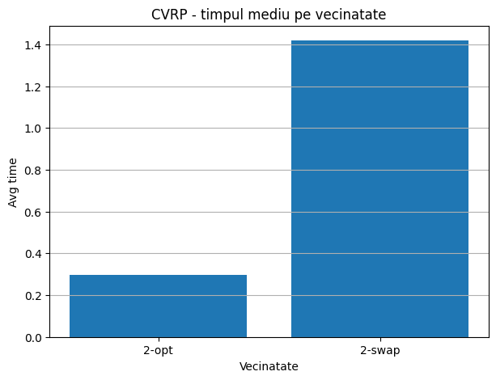
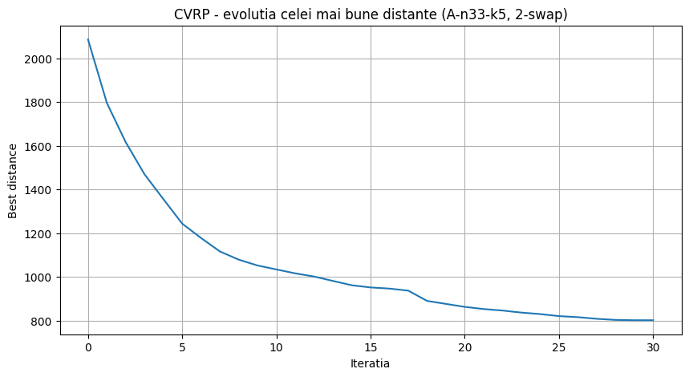
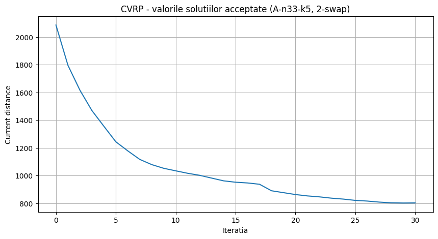
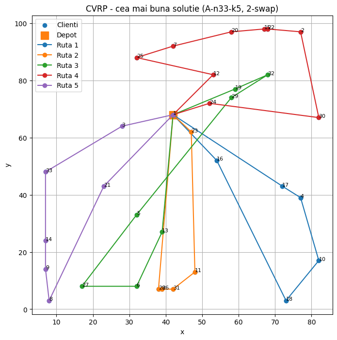
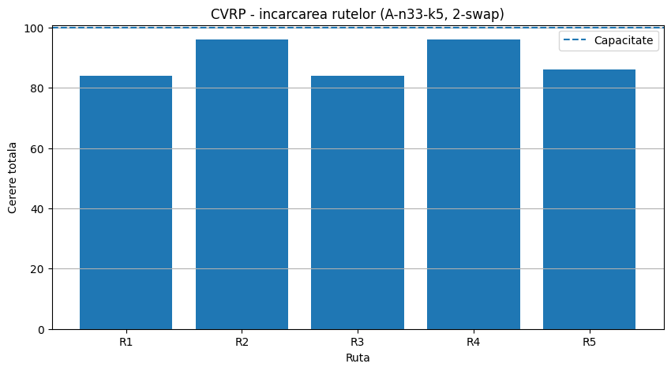

# Capacitated Vehicle Routing Problem (CVRP) — Tabu Search Metaheuristic

[](https://www.python.org/downloads/)
[]()
[-green.svg)]()
[]()

An end-to-end Python implementation and experimental benchmark of the **Tabu Search (TS)** metaheuristic applied to the **Capacitated Vehicle Routing Problem (CVRP)**. The project evaluates neighborhood structures (`2-swap` vs. `2-opt`), tabu memory dynamics, and aspiration criteria across the standard **Augerat et al. (Set A)** benchmark suite (`A-VRP`).

---

## Table of Contents

1. [Problem Formulation](#problem-formulation)
2. [Tabu Search Algorithm Architecture](#tabu-search-algorithm-architecture)
   - [Initial Solution Construction](#1-initial-solution-construction)
   - [Neighborhood Exploration (`2-swap` vs. `2-opt`)](#2-neighborhood-exploration-2-swap-vs-2-opt)
   - [Tabu List & Memory Dynamics](#3-tabu-list--memory-dynamics)
   - [Aspiration Criterion](#4-aspiration-criterion)
   - [Algorithmic Workflow](#5-algorithmic-workflow)
3. [Experimental Benchmark & Evaluation](#experimental-benchmark--evaluation)
   - [Dataset & Setup](#dataset--setup)
   - [Neighborhood Performance Comparison](#neighborhood-performance-comparison)
   - [Instance-by-Instance Best Configuration Results](#instance-by-instance-best-configuration-results)
4. [Visual Analysis & Discussion](#visual-analysis--discussion)
   - [1. Best Solution per Instance](#1-best-solution-per-instance)
   - [2. Head-to-Head: 2-swap vs. 2-opt per Instance](#2-head-to-head-2-swap-vs-2-opt-per-instance)
   - [3. Win Distribution Across Instances](#3-win-distribution-across-instances)
   - [4. Execution Time Trade-Off](#4-execution-time-trade-off)
   - [5. Search Trajectory & Convergence (`A-n33-k5`)](#5-search-trajectory--convergence-a-n33-k5)
   - [6. Search History & Exploration of Non-Improving Moves](#6-search-history--exploration-of-non-improving-moves)
   - [7. Optimized Route Map (`A-n33-k5`)](#7-optimized-route-map-a-n33-k5)
   - [8. Fleet Load Distribution vs. Capacity Limit](#8-fleet-load-distribution-vs-capacity-limit)
5. [Key Insights & Conclusions](#key-insights--conclusions)
6. [Repository Structure](#repository-structure)
7. [Getting Started](#getting-started)
   - [Prerequisites](#prerequisites)
   - [Installation](#installation)
   - [Command-Line Interface (CLI)](#command-line-interface-cli)
   - [Jupyter Notebook](#jupyter-notebook)
8. [References](#references)

---

## Problem Formulation

The **Capacitated Vehicle Routing Problem (CVRP)** is a classic NP-hard combinatorial optimization problem. Given:
- A central **depot** $d$ (node $1$) where a fleet of $k$ identical vehicles is based.
- A set of $n-1$ customer nodes $V = \{2, \dots, n\}$, each with known Euclidean coordinates $(x_i, y_i)$ and positive demand $q_i > 0$.
- A uniform vehicle load capacity $Q > 0$.

The objective is to design a set of at most $k$ routes such that:
1. Each customer is visited **exactly once** by exactly one vehicle.
2. Every route **starts and ends at the depot**.
3. The total customer demand on any route does not exceed the vehicle capacity $Q$:
   $$\sum_{i \in R_r} q_i \le Q, \quad \forall r \in \{1, \dots, k\}$$
4. The total Euclidean travel distance across all routes is **minimized**:
   $$\min \sum_{r=1}^{k} \text{Cost}(R_r)$$
   where for route $R_r = (d, c_1, c_2, \dots, c_m, d)$, the route cost is:
   $$\text{Cost}(R_r) = \text{dist}(d, c_1) + \sum_{j=1}^{m-1} \text{dist}(c_j, c_{j+1}) + \text{dist}(c_m, d)$$

---

## Tabu Search Algorithm Architecture

```
                      +-----------------------------+
                      |   Construct Initial Sol.    |
                      |  (Best-Fit Decreasing)      |
                      +--------------+--------------+
                                     |
                                     v
                      +-----------------------------+
                      | Generate All Valid Neighbors|
                      |       (2-swap / 2-opt)      |
                      +--------------+--------------+
                                     |
                                     v
                      +-----------------------------+
                      | Filter by Tabu Memory &     |
                      | Aspiration Criterion        |
                      +--------------+--------------+
                                     |
                                     v
                      +-----------------------------+
                      | Select Best Valid Candidate |
                      +--------------+--------------+
                                     |
                                     v
                      +-----------------------------+
                      | Update Tabu Tenure & State  |
                      +--------------+--------------+
                                     |
                         [iterations < max_iter]
                                     |
                                     v
                      +-----------------------------+
                      |    Return Best Global Sol   |
                      +-----------------------------+
```

### 1. Initial Solution Construction
Initial feasible solutions are constructed using a randomized **Greedy Best-Fit Decreasing (BFD)** heuristic:
- Customers are sorted in descending order of demand $q_i$.
- Each customer is placed into the feasible vehicle route that minimizes remaining slack capacity ($\arg\min (Q - \text{load}_r - q_i)$).
- Internal customer order within each route is randomized to inject diversity across multiple independent runs.

### 2. Neighborhood Exploration (`2-swap` vs. `2-opt`)
Two distinct neighborhood operators are implemented and empirically compared:

- **`2-swap` (Inter- & Intra-Route Node Exchange)**:
  Selects any two customers $c_1 \in R_a$ and $c_2 \in R_b$ (whether in the same route $a = b$ or distinct routes $a \ne b$) and swaps their positions.
  - *Feasibility check*: Re-verifies vehicle capacity constraints for both affected routes.
  - *Move signature*: `("2-swap", min(c1, c2), max(c1, c2))`.
  - *Strength*: Enables structural reallocation of customers across different vehicles, dynamically rebalancing loads.

- **`2-opt` (Intra-Route Segment Inversion)**:
  Selects a single route $R_r$ containing at least two customers and reverses the sub-sequence between indices $i$ and $j$:
  $$(c_1, \dots, c_i, c_{i+1}, \dots, c_j, \dots, c_m) \longrightarrow (c_1, \dots, c_j, \dots, c_{i+1}, c_i, \dots, c_m)$$
  - *Feasibility check*: Customer set per vehicle remains unchanged; capacity constraint is automatically preserved.
  - *Move signature*: `("2-opt", route_idx, min(c1, c2), max(c1, c2))`.
  - *Strength*: Extremely fast local edge untangling within individual routes.

### 3. Tabu List & Memory Dynamics
To prevent cycling and escape local minima, accepted moves are recorded in a **Tabu List** dictionary:
$$\text{Tabu}[move] = \theta$$
where $\theta$ is the **Tabu Tenure** (number of iterations the move remains forbidden). In each subsequent iteration, remaining tenures are decremented:
$$\text{Tabu}[m] \leftarrow \text{Tabu}[m] - 1$$
When $\text{Tabu}[m] \le 0$, the move is released from memory.

### 4. Aspiration Criterion
A tabu restriction is overridden if a neighbor solution achieves a total distance strictly superior to the best global distance found so far:
$$f(s') < f_{\text{best}}$$
This guarantees that the search never discards an all-time best solution solely due to tabu status.

### 5. Algorithmic Workflow



*Figure 1: Core algorithmic loop of the Tabu Search metaheuristic with neighborhood generation, memory update, and best-so-far tracking.*

---

## Experimental Benchmark & Evaluation

### Dataset & Setup
- **Benchmark Suite**: 27 standard instances from **Augerat et al. (Set A)** (`data/A-VRP.zip`).
- **Fleet & Customer Scale**: Problem sizes range from $n=32$ customers / $k=5$ vehicles (`A-n32-k5`) up to $n=80$ customers / $k=10$ vehicles (`A-n80-k10`).
- **Parameter Grid**:
  - `(max_iterations=20, tabu_tenure=2)`
  - `(max_iterations=30, tabu_tenure=3)`
  - `(max_iterations=50, tabu_tenure=5)`
- **Repetitions**: $n\_runs = 3$ independent runs per configuration (486 total algorithm executions) to mitigate stochastic variance from the initial solution generator.

### Neighborhood Performance Comparison

| Neighborhood Operator | Total Benchmark Wins | Average Best Distance | Average Execution Time (s) | Average Vehicles Used |
| :--- | :---: | :---: | :---: | :---: |
| **`2-swap`** | **27 / 27 (100%)** | **1,324.31** | **1.4183 s** | **7.07** |
| **`2-opt`** | 0 / 27 (0%) | 1,748.54 | 0.2982 s | 7.07 |

> **Key Takeaway**: `2-swap` decisively won **all 27 instances**, producing an average total distance that is **24.3% shorter** than `2-opt` (1,324.31 vs. 1,748.54). While `2-opt` is ~4.7x faster due to only reversing intra-route segments without capacity recalculation, it cannot migrate customers across vehicles. `2-swap` is essential for global route restructuring.

### Instance-by-Instance Best Configuration Results

The table below summarizes the best configuration found for each of the 27 benchmark instances:

| Instance ($\pi$) | Best Neighborhood | Max Iterations | Tabu Tenure | Best Distance | Avg Distance | Avg Time (s) | Vehicles | Max Load | Avg Load |
| :--- | :---: | :---: | :---: | :---: | :---: | :---: | :---: | :---: | :---: |
| **A-n32-k5** | `2-swap` | 20 | 2 | 1,013.50 | 1,074.45 | 0.1544 | 5 | 100 / 100 | 82.00 |
| **A-n33-k5** | `2-swap` | 30 | 3 | **802.06** | 829.98 | 0.2893 | 5 | 96 / 100 | 89.20 |
| **A-n33-k6** | `2-swap` | 50 | 5 | 841.18 | 879.62 | 0.6479 | 6 | 99 / 100 | 90.17 |
| **A-n34-k5** | `2-swap` | 50 | 5 | 892.28 | 921.24 | 0.4363 | 5 | 99 / 100 | 92.00 |
| **A-n36-k5** | `2-swap` | 30 | 3 | 906.75 | 978.28 | 0.3666 | 5 | 99 / 100 | 88.40 |
| **A-n37-k5** | `2-swap` | 30 | 3 | 908.54 | 962.63 | 0.4354 | 5 | 96 / 100 | 81.40 |
| **A-n37-k6** | `2-swap` | 50 | 5 | 1,066.43 | 1,155.93 | 0.4795 | 6 | 100 / 100 | 95.00 |
| **A-n38-k5** | `2-swap` | 30 | 3 | 932.54 | 985.46 | 0.2763 | 5 | 100 / 100 | 96.20 |
| **A-n39-k5** | `2-swap` | 30 | 3 | 1,034.93 | 1,059.90 | 0.4112 | 5 | 99 / 100 | 95.00 |
| **A-n39-k6** | `2-swap` | 50 | 5 | 933.58 | 965.02 | 0.7252 | 6 | 95 / 100 | 87.67 |
| **A-n44-k6** | `2-swap` | 50 | 5 | 1,153.14 | 1,175.25 | 1.2874 | 6 | 99 / 100 | 95.00 |
| **A-n45-k6** | `2-swap` | 50 | 5 | 1,295.28 | 1,348.00 | 0.6222 | 6 | 100 / 100 | 98.83 |
| **A-n45-k7** | `2-swap` | 50 | 5 | 1,320.99 | 1,361.44 | 1.3606 | 7 | 98 / 100 | 90.57 |
| **A-n46-k7** | `2-swap` | 50 | 5 | 1,140.35 | 1,253.36 | 0.8012 | 7 | 100 / 100 | 86.14 |
| **A-n48-k7** | `2-swap` | 30 | 3 | 1,247.64 | 1,383.71 | 0.9027 | 7 | 99 / 100 | 89.43 |
| **A-n53-k7** | `2-swap` | 50 | 5 | 1,383.61 | 1,407.64 | 1.5259 | 7 | 100 / 100 | 94.86 |
| **A-n54-k7** | `2-swap` | 50 | 5 | 1,497.81 | 1,577.47 | 1.6341 | 7 | 100 / 100 | 95.57 |
| **A-n55-k9** | `2-swap` | 50 | 5 | 1,470.87 | 1,480.44 | 1.9742 | 9 | 100 / 100 | 93.22 |
| **A-n60-k9** | `2-swap` | 50 | 5 | 1,614.86 | 1,765.03 | 2.3007 | 9 | 100 / 100 | 92.11 |
| **A-n61-k9** | `2-swap` | 50 | 5 | 1,482.32 | 1,538.98 | 1.5307 | 9 | 100 / 100 | 98.33 |
| **A-n62-k8** | `2-swap` | 50 | 5 | 1,692.30 | 1,750.10 | 2.6637 | 8 | 100 / 100 | 91.62 |
| **A-n63-k10** | `2-swap` | 50 | 5 | 1,592.94 | 1,697.76 | 2.6082 | 10 | 100 / 100 | 93.20 |
| **A-n63-k9** | `2-swap` | 50 | 5 | 2,052.12 | 2,159.10 | 1.9050 | 9 | 100 / 100 | 97.00 |
| **A-n64-k9** | `2-swap` | 50 | 5 | 1,724.79 | 1,773.39 | 2.8086 | 9 | 100 / 100 | 94.22 |
| **A-n65-k9** | `2-swap` | 50 | 5 | 1,799.73 | 1,871.80 | 1.9457 | 9 | 100 / 100 | 97.44 |
| **A-n69-k9** | `2-swap` | 50 | 5 | 1,633.73 | 1,691.22 | 3.3235 | 9 | 100 / 100 | 93.89 |
| **A-n80-k10** | `2-swap` | 50 | 5 | 2,322.18 | 2,364.30 | 4.8790 | 10 | 100 / 100 | 94.20 |

---

## Visual Analysis & Discussion

All visualizations below are directly extracted from the experimental pipeline in [`notebook_tabu-search.ipynb`](notebooks/notebook_tabu-search.ipynb).

### 1. Best Solution per Instance



*Figure 2: Best total Euclidean distance achieved by Tabu Search across each of the 27 benchmark instances.*

- **Scaling Dynamics**: Distance scales smoothly with customer count and geographic dispersion. Smaller instances such as `A-n33-k5` achieve the lowest overall distance (**802.06**), whereas large-scale instances such as `A-n80-k10` demand longer overall paths (**2,322.18**).
- **Feasibility**: All solutions strictly satisfy the fleet size $k$ and vehicle capacity limit $Q=100$.

---

### 2. Head-to-Head: 2-swap vs. 2-opt per Instance



*Figure 3: Side-by-side comparison of `2-swap` (left) and `2-opt` (right) best distances for every benchmark instance.*

- **Systematic Superiority**: On every single benchmark instance, the bar corresponding to `2-swap` is lower than the bar for `2-opt`.
- **Structural Bottleneck of 2-opt**: In CVRP, an initial solution assigns customers to vehicles based on greedy demand packing. If customer allocations across vehicles are sub-optimal, `2-opt` can only re-order customers *within* each vehicle; it can never transfer an isolated customer to a more geographically congruent vehicle. `2-swap` breaks this barrier.

---

### 3. Win Distribution Across Instances



*Figure 4: Total instances won by each neighborhood operator (lowest Best Distance).*

- **Clean Sweep**: `2-swap` won **27 instances**, while `2-opt` won **0**.
- Confirms that for multi-vehicle routing problems, **cross-route transfer moves are mandatory** to achieve competitive solution quality.

---

### 4. Execution Time Trade-Off



*Figure 5: Average computational runtime per run for `2-opt` vs. `2-swap`.*

- **Runtime Comparison**: `2-opt` executes in **~0.30 seconds** on average, whereas `2-swap` requires **~1.42 seconds** (a ~4.7x factor).
- **Algorithmic Complexity**:
  - `2-opt` checks $O(\sum |R_r|^2)$ intra-route inversions and bypasses capacity validation since total route loads remain constant.
  - `2-swap` evaluates all pairs across all routes $O((\sum |R_r|)^2) = O(n^2)$ and performs capacity validation on each candidate.
- **Engineering Verdict**: For time-critical real-time dispatch, `2-opt` provides rapid local improvements; for route quality optimization, `2-swap` is superior.

---

### 5. Search Trajectory & Convergence (`A-n33-k5`)



*Figure 6: Best-so-far objective value ($f_{\text{best}}$) evolution over 30 iterations for instance `A-n33-k5` (`2-swap`).*

- **Steep Early Descent**: Within the first 5–10 iterations, the objective drops dramatically from over $2,090$ down to $\approx 1,050$.
- **Refinement Phase**: From iteration 15 to 30, the algorithm makes localized improvements, converging to the final best solution of **802.06**.
- **Plateau Behavior**: Horizontal segments indicate iterations where neighbors were explored without improving $f_{\text{best}}$, allowing Tabu Search to navigate through neutral ridges in the search landscape.

---

### 6. Search History & Exploration of Non-Improving Moves



*Figure 7: Objective values of accepted candidate solutions at each iteration step ($f(s_t)$).*

- **Escaping Local Minima**: Unlike pure descent heuristics (e.g., Hill Climbing), Tabu Search can accept deteriorating solutions when all improving moves are tabu.
- **Controlled Diversification**: When the search encounters a local basin, the combination of tabu penalties and aspiration pushes the trajectory into alternative regions of the search space rather than cycling.

---

### 7. Optimized Route Map (`A-n33-k5`)



*Figure 8: 2D spatial visualization of the 5 vehicle routes for instance `A-n33-k5` (best distance: 802.06).*

- **Depot**: Red square at coordinates $(42, 68)$ (node 1).
- **Customer Partitioning**:
  - **Route 1 (Blue)**: $[17, 4, 10, 18, 16]$ — Southeastern loop.
  - **Route 2 (Orange)**: $[28, 26, 31, 11, 23]$ — South-central corridor.
  - **Route 3 (Green)**: $[13, 6, 27, 5, 29, 32, 19]$ — Southwestern and northeastern sweep.
  - **Route 4 (Red)**: $[24, 30, 2, 22, 15, 20, 7, 25, 12]$ — Northern semi-circle.
  - **Route 5 (Purple)**: $[3, 33, 14, 9, 8, 21]$ — Western perimeter.
- **Geometric Regularity**: Routes show high spatial clustering radiating outward from the central depot with minimal route intertwining.

---

### 8. Fleet Load Distribution vs. Capacity Limit



*Figure 9: Total customer demand served per vehicle route vs. maximum capacity $Q=100$ for `A-n33-k5`.*

- **Feasibility Verification**: All vehicle loads ($84$, $96$, $84$, $96$, $86$) remain strictly below the dashed red capacity line ($Q=100$).
- **Capacity Utilization**:
  - Minimum route load: **84%**
  - Maximum route load: **96%**
  - Average load factor: **89.2%**
- Demonstrates balanced vehicle utilization across the fleet without overloading any single vehicle.

---

## Key Insights & Conclusions

1. **Neighborhood Expressiveness**: In CVRP, node exchange (`2-swap`) is fundamentally more expressive than sequence inversion (`2-opt`) because it bridges route boundaries, reallocating customers among vehicles to optimize spatial clustering.
2. **Iteration Depth**: Across the tested parameter combinations, $(max\_iterations=50, tabu\_tenure=5)$ yielded the highest solution quality for 18 out of 27 instances, indicating that deeper exploration pays significant dividends in CVRP.
3. **Tabu Memory Effect**: Tabu tenure effectively avoids short-term cycles, while the aspiration criterion ensures that breakthroughs to new global optima are immediately captured.
4. **Computational Scalability**: Even on the largest instance (`A-n80-k10`, 80 nodes, 10 vehicles), 50 iterations of `2-swap` complete in under **5 seconds**, making Tabu Search well-suited for practical dispatch scenarios.

---

## Repository Structure

```
cvrp-tabu-search/
|-- data/
|   `-- A-VRP.zip                    # Augerat et al. Set A benchmark instances (.vrp)
|-- docs/
|   `-- images/                      # High-resolution experiment plots & diagrams
|       |-- average_time_by_neighborhood.png
|       |-- best_distance_per_instance.png
|       |-- comparison_2swap_vs_2opt.png
|       |-- convergence_best_distance_a_n33_k5.png
|       |-- neighborhood_wins.png
|       |-- optimized_routes_a_n33_k5.png
|       |-- route_loads_a_n33_k5.png
|       |-- search_history_accepted_a_n33_k5.png
|       `-- tabu_search_flowchart.png
|-- notebooks/
|   `-- notebook_tabu-search.ipynb   # Complete interactive experimental study
|-- src/
|   |-- __init__.py
|   |-- io_utils.py                  # TSPLIB .vrp parser & distance matrix utilities
|   |-- tabu_search.py               # Tabu Search optimizer, moves & neighborhoods
|   `-- visualization.py             # Route plotting, history & load charts
|-- main.py                          # CLI runner for custom instance optimization
`-- README.md                        # Documentation & experimental report
```

---

## Getting Started

### Prerequisites
- Python 3.10 or newer (tested on Python 3.12 and 3.13)
- `matplotlib`

### Installation

```bash
# Clone the repository
git clone https://github.com/amiraaa83/cvrp-tabu-search.git
cd cvrp-tabu-search

# Create and activate a virtual environment (optional but recommended)
python -m venv .venv
source .venv/bin/activate  # On Windows: .venv\Scripts\activate

# Install dependencies
pip install matplotlib
```

### Command-Line Interface (CLI)

Run `main.py` to optimize any instance from the benchmark dataset:

```bash
# Run with default settings (A-n33-k5, 2-swap, 50 iterations, tenure 5)
python main.py

# Solve a specific instance with custom parameters
python main.py --instance A-n32-k5 --neighborhood 2-swap --iterations 50 --tenure 5

# Compare with 2-opt neighborhood
python main.py --instance A-n33-k5 --neighborhood 2-opt --iterations 50 --tenure 5

# Headless mode (suppress GUI plot windows)
python main.py --instance A-n60-k9 --no-plot
```

#### Available CLI Arguments:
| Argument | Type | Default | Description |
| :--- | :---: | :---: | :--- |
| `--data` | `str` | `data/A-VRP.zip` | Path to the `.zip` archive containing `.vrp` instances |
| `--instance` | `str` | `A-n33-k5` | Name of the instance to solve (e.g. `A-n32-k5`, `A-n80-k10`) |
| `--neighborhood` | `str` | `2-swap` | Neighborhood operator: `2-swap` or `2-opt` |
| `--iterations` | `int` | `50` | Maximum number of Tabu Search iterations |
| `--tenure` | `int` | `5` | Tabu tenure duration (memory lifespan) |
| `--no-plot` | `flag`| `False` | Disable interactive matplotlib window display |

### Jupyter Notebook

To reproduce the benchmark experiments and generate the tables and plots:

```bash
jupyter notebook notebooks/notebook_tabu-search.ipynb
```

---

## References

1. **Augerat, P., Belenguer, J. M., Benavent, E., Corberán, A., Naddef, D., & Rinaldi, G. (1995)**. *Computational results with a branch-and-cut code for the capacitated vehicle routing problem*. Research Report 949-M, Université Joseph Fourier, Grenoble, France.
2. **Glover, F. (1989)**. *Tabu Search — Part I*. ORSA Journal on Computing, 1(3), 190–206.
3. **Gendreau, M., Hertz, A., & Laporte, G. (1994)**. *A tabu search heuristic for the vehicle routing problem*. Management Science, 40(10), 1276–1290.
4. **Reinelt, G. (1991)**. *TSPLIB — A Library of Traveling Salesman and Related Problem Instances*. ORSA Journal on Computing, 3(4), 376–384.